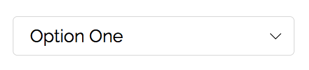

# fern

**fern** is a set of catered CSS resets which standardize results across all modern browsers.

 This includes completely replacing the select arrow.

  

## Installation

- Download: [`fern.css`](https://github.com/asvln/fern/releases)

## Credits

**fern** brings together the reset approaches of [minireset.css](https://github.com/jgthms/minireset.css) and [normalize.css](https://github.com/necolas/normalize.css) with additional styling.
